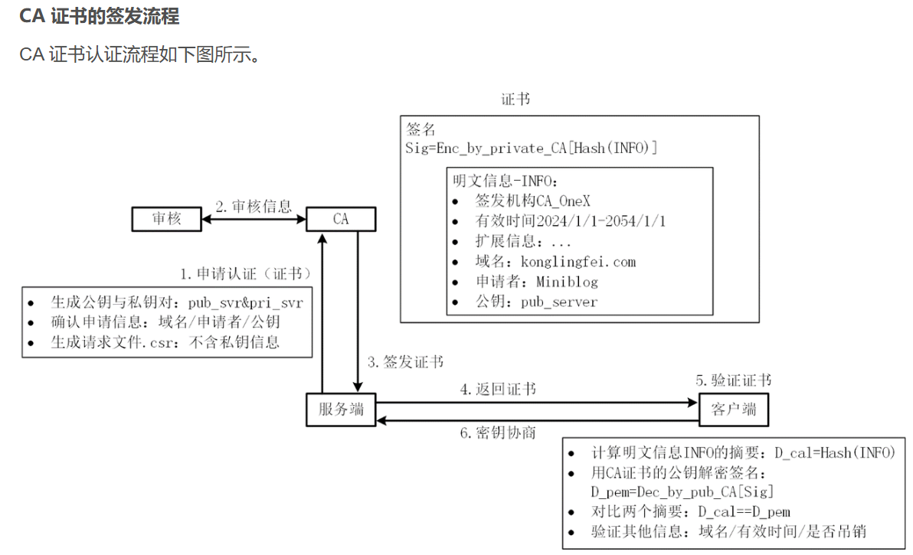
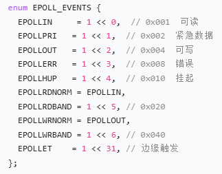

#### 有一个 IP 的服务器监听了一个端口，它的 TCP 的最大连接数是多少？

#### 为什么ET工作模式下，对应的fd读取必须是非阻塞的？

#### 什么是 SYN 攻击？如何避免 SYN 攻击？

#### 为什么需要三次握手？

#### 为什么需要四次挥手？

#### TIME_WAIT状态（为什么需要两倍MSL）

#### TCP 协议保证可靠传输的手段

1. ##### 重传机制

2. ##### 滑动窗口

3. ##### 流量控制

4. ##### 拥塞控制

#### EPOLL原理

#### 为什么 HTTPS 比 HTTP 更安全？它的加密机制？

中间人替换服务器公钥，这才是中间人攻击的唯一路径。

​		服务器首先生成公钥 (S) 与私钥 (S’) ，然后整理证书申请信息，包括域名，申请者，公钥等，对申请信息生成.csr请求文件，服务厂商向CA机构发送该.csr文件申请证书。CA机构有自己的公钥和私钥，CA机构利用hash算法对申请者的明文信息形成摘要，再利用CA私钥对摘要加密得到数字签名，然后向申请者签发证书。证书中包含数字签名以及明文信息。（明文信息得到哈希摘要是单向的不能解密）

​		当客户端发起https请求时，服务端会返回证书，客户端对证书的明文信息通过hash算法形成摘要1，再用CA机构的公钥（操作系统 / 浏览器内置）对数字签名进行解密得到摘要2与摘要1进行比较，若相同则证书未被篡改，否则证书已经被人篡改过。至此，客户端成功拿到服务端的公钥。

​		客户端生成对称密钥，利用服务端公钥对对称密钥加密，发送给服务端，服务端再利用私钥进行解密，成功拿到对称密钥，双方通过对称密钥对数据加密，进行通信。

#### 完整宏定义（Linux 标准）

