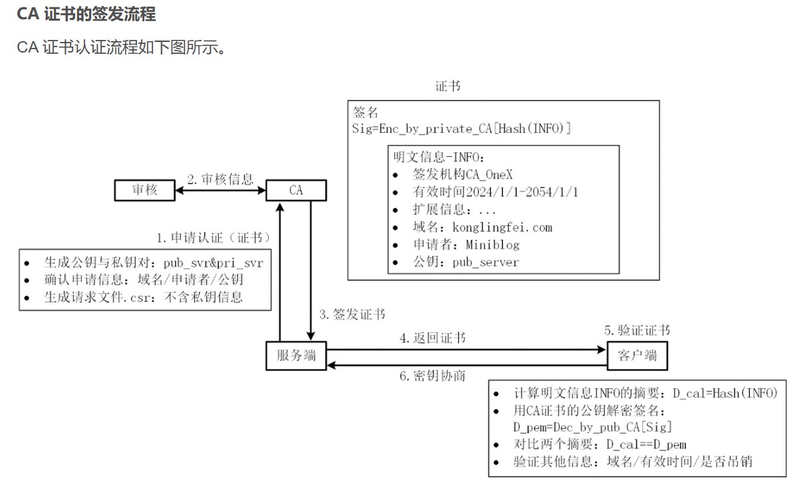
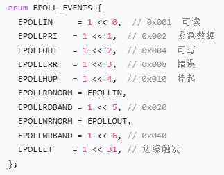
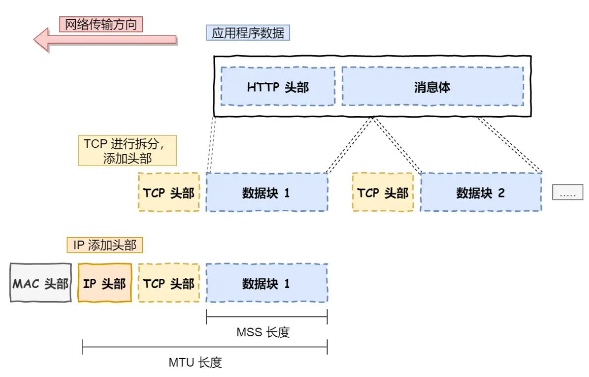
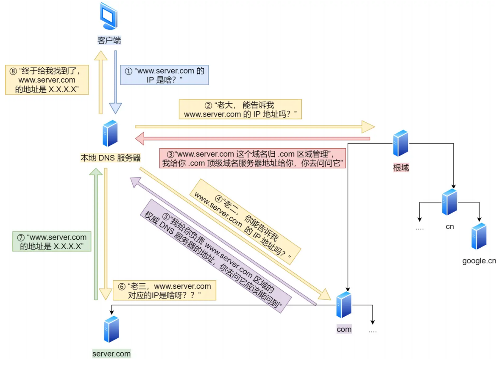
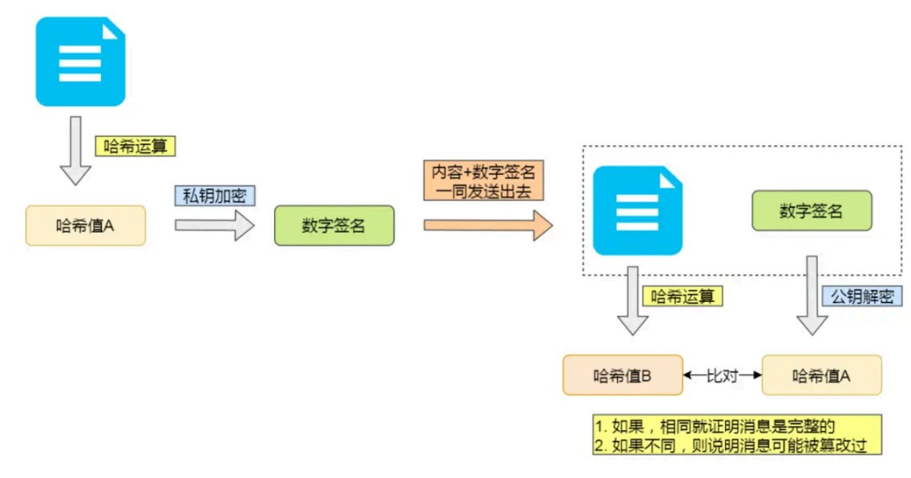
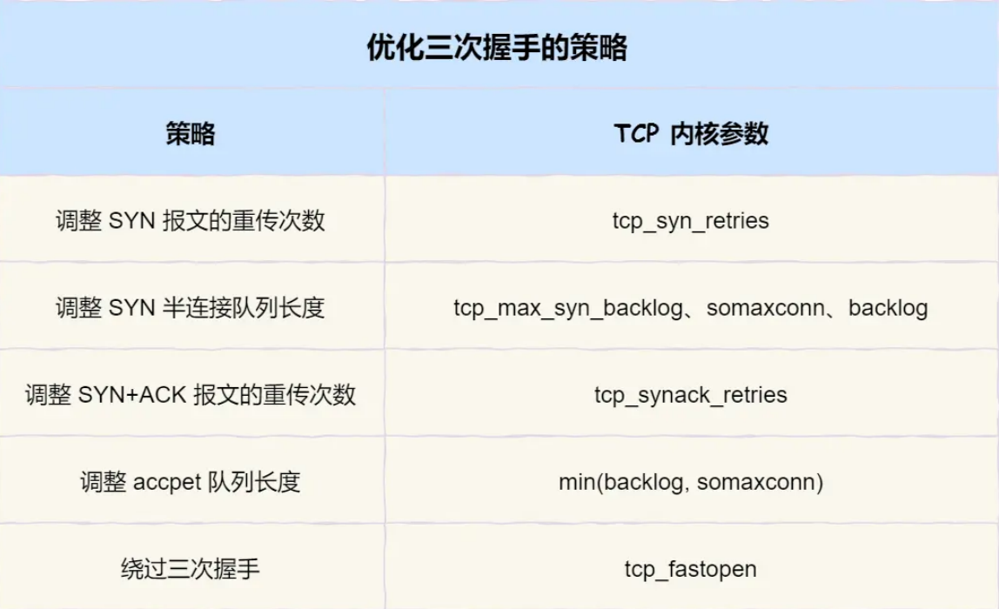

#### 有一个 IP 的服务器监听了一个端口，它的 TCP 的最大连接数是多少？

#### 为什么ET工作模式下，对应的fd读取必须是非阻塞的？

#### 什么是 SYN 攻击？如何避免 SYN 攻击？

SYN 攻击⽅式最直接的表现就会把 TCP 半连接队列打满，这样**当** **TCP** **半连接队列满了，后续再在收到**SYN **报⽂就会丢弃**，导致客户端⽆法和服务端建⽴连接。

1. 调⼤ netdev_max_backlog；

2. 增⼤ TCP 半连接队列；

3. 开启 **tcp_syncookies**。开启 syncookies 功能就可以在不使⽤ SYN 半连接队列的情况下成功建⽴连接，相当于绕过了 SYN 半连

   接来建⽴连接。

4. 减少 SYN+ACK 重传次数

#### 为什么需要三次握手？

1. 最主要原因就是防⽌「历史连接」初始化了连接。
2. 同步双⽅初始序列号。两次握⼿只保证了⼀⽅的初始序列号能被对⽅成功接收，没办法保证双⽅的初始序列号都能被确认接收。
3. 避免资源浪费。两次握⼿会造成消息滞留情况下，服务端重复接受⽆⽤的连接请求 SYN 报⽂，⽽造成重复分配资源。两次握手的情况下，服务端收到SYN报文就会建立连接
4. 「两次握⼿」：⽆法防⽌历史连接的建⽴，会造成双⽅资源的浪费，也⽆法可靠的同步双⽅序列号；

建立连接交换的信息：TCP 协议在**建⽴连接的时候通常要协商双⽅的** **MSS** **值**，

#### 为什么需要四次挥手？

#### TIME_WAIT状态（为什么需要两倍MSL）

客户端在收到服务端重传的 FIN 报⽂时，TIME_WAIT 状态的等待时间，会重置回 2MSL

#### **为什么需要** **TIME_WAIT** 状态？

1. 防⽌历史连接中的数据，被后⾯相同四元组的连接错误的接收。

   为了防⽌历史连接中的数据，被后⾯相同四元组的连接错误的接收，因此 TCP 设计了 TIME_WAIT 状态，

   状态会持续 2MSL 时⻓，这个时间**⾜以让两个⽅向上的数据包都被丢弃，使得原来连接的数据包在⽹络**

   **中都⾃然消失，再出现的数据包⼀定都是新建⽴连接所产⽣的。**

2. 保证「被动关闭连接」的⼀⽅，能被正确的关闭

   TIME-WAIT 作⽤是**等待⾜够的时间以确保最后的** **ACK** **能让被动关闭⽅接收，从⽽帮助其正常**

   **关闭。**

#### TCP 协议保证可靠传输的手段

1. ##### 重传机制

2. ##### 滑动窗口

3. ##### 流量控制

4. ##### 拥塞控制

#### EPOLL原理

#### 为什么 HTTPS 比 HTTP 更安全？它的加密机制？

中间人替换服务器公钥，这才是中间人攻击的唯一路径。

​		服务器首先生成公钥 (S) 与私钥 (S’) ，然后整理证书申请信息，包括域名，申请者，公钥等，对申请信息生成.csr请求文件，服务厂商向CA机构发送该.csr文件申请证书。CA机构有自己的公钥和私钥，CA机构利用hash算法对申请者的明文信息形成摘要，再利用CA私钥对摘要加密得到数字签名，然后向申请者签发证书。证书中包含数字签名以及明文信息。（明文信息得到哈希摘要是单向的不能解密）

​		当客户端发起https请求时，服务端会返回证书，客户端对证书的明文信息通过hash算法形成摘要1，再用CA机构的公钥（操作系统 / 浏览器内置）对数字签名进行解密得到摘要2与摘要1进行比较，若相同则证书未被篡改，否则证书已经被人篡改过。至此，客户端成功拿到服务端的公钥。

​		客户端生成对称密钥，利用服务端公钥对对称密钥加密，发送给服务端，服务端再利用私钥进行解密，成功拿到对称密钥，双方通过对称密钥对数据加密，进行通信。

#### 完整宏定义（Linux 标准）

#### 交换机

交换机的作用就是在局域网内部连接多台设备，并根据 MAC 地址把数据帧转发到正确的端口

#### 如何解决粘包问题

前面加上数据长度；利用特殊字符（如：\n）作为不同数据包的分界点。可以参考http的请求格式

#### 为什么每次建⽴TCP 连接时，初始化的序列号都要求不⼀样呢？

如果每次建⽴连接，客户端和服务端的初始化序列号都是⼀样的话，很容易出现历史报⽂被下⼀个相同四元组的连接接收的问题

#### **服务器出现⼤量** **TIME_WAIT** **状态的原因有哪些？**

1. HTTP 没有使⽤⻓连接。**当服务端出现⼤量的** **TIME_WAIT** **状态连接的时候，可以排查下是否客户端和服务端都开启了HTTP Keep-Alive**。因为任意⼀⽅没有开启 HTTP Keep-Alive，都会导致服务端在处理完⼀个 HTTP 请求后，就主动关闭连接，此时服务端上就会出现⼤量的 TIME_WAIT 状态的连接。

2. HTTP ⻓连接超时。当服务端出现⼤ᰁ TIME_WAIT 状态的连接时，如果现象是有⼤ᰁ的客户端建⽴完 TCP 连接后，很⻓⼀段时间没有发送数据，那么⼤概率就是因为 HTTP ⻓连接超时，导致服务端主动关闭连接，产⽣⼤量处于TIME_WAIT 状态的连接。

3. HTTP ⻓连接的请求数量达到上限。

#### listen 时候参数 backlog的意义？

Linux内核中会维护两个队列：

​	半连接队列（SYN 队列）：接收到⼀个 SYN 建⽴连接请求，处于 SYN_RCVD 状态；

​	全连接队列（Accpet 队列）：已完成 TCP 三次握⼿过程，处于 ESTABLISHED 状态；

backlog 是 accept 队列。**但是上限值是内核参数** **somaxconn** **的⼤⼩，也就说** **accpet** **队列⻓度** **= min(backlog, somaxconn)**

#### **没有** **listen**，能建⽴**TCP** **连接吗？**

答案：**可以的**。

客户端是可以⾃⼰连⾃⼰的形成连接（**TCP**⾃连接），也可以两个客户端同时向对⽅发出请求建⽴连接（**TCP**同时打开**），这两个情况都有个共同点，就是**没有服务端参与，也就是没有 **listen**，就能 **TCP** **建⽴**连接。

#### **TCP** **第⼀次握⼿的** **SYN** **丢包了，会发⽣了什么？**

当客户端发起的 TCP 第⼀次握⼿ SYN 包，在超时时间内没收到服务端的 ACK，就会在超时重传 SYN 数据包，每次超时重传的 RTO 是翻倍上涨的，直到 SYN 包的重传次数到达 tcp_syn_retries 值后，客户端不再发送 SYN 包。

#### **TCP** **第⼆次握⼿的** **SYN、ACK **丢包了，会发⽣什么？

当 TCP 第⼆次握⼿ SYN、ACK 包丢了后，客户端 SYN 包会发⽣超时重传，服务端 SYN、ACK 也会发⽣超时重传。

客户端 SYN 包超时重传的最⼤次数，是由 tcp_syn_retries 决定的，默认值是 5 次；服务端 SYN、ACK 包时重传的最⼤次数，是由 tcp_synack_retries 决定的，默认值是 5 次。

#### **TCP** **第三次握⼿的** **ACK** **包丢了，会发⽣什么？**

在建⽴ TCP 连接时，如果第三次握⼿的 ACK，服务端⽆法收到，则服务端就会短暂处于 SYN_RECV 状态，⽽客户端会处于 ESTABLISHED 状态。由于服务端⼀直收不到 TCP 第三次握⼿的 ACK，则会⼀直重传 SYN、ACK 包，直到重传次数超过 tcp_synack_retries 值（默认值 5次）后，服务端就会断开 TCP 连接。

⽽客户端则会有两种情况：

如果客户端没发送数据包，⼀直处于 ESTABLISHED 状态，然后经过 2 ⼩时 11 分 15 秒才可以发现⼀个「死亡」连接，于是客户端连接就会断开连接。

如果客户端发送了数据包，⼀直没有收到服务端对该数据包的确认报⽂，则会⼀直重传该数据包，直到重传次数超过 tcp_retries2 值（默认值 15 次）后，客户端就会断开 TCP 连接。

#### MSL、RTO、TTL、MTU、MSS

`RTO` 是 **Retransmission Timeout**，中文通常叫 **重传超时时间**

在 TCP 里，发送方发出一个数据包后，会等待对方返回 `ACK`。如果在一段时间内没等到 ACK，TCP 就认为这个包可能丢了，于是会重传。这个等待时间就是 `RTO`。

`RTT` 是 **Round Trip Time**，中文叫 **往返时间**。

一个数据包从你的机器发出去，到对方回应回来，总共花了多久。

**MSS** 指的是：**Maximum Segment Size**（最大报文段长度）

表示一个 TCP 报文段中能够携带的最大应用层数据（Payload）长度，不包括 TCP 首部和 IP 首部。

#### 延迟确认 和 Nagle 算法混合使⽤时，会产⽣新的问题？

#### TCP Fast Open、tcp_syncookies

